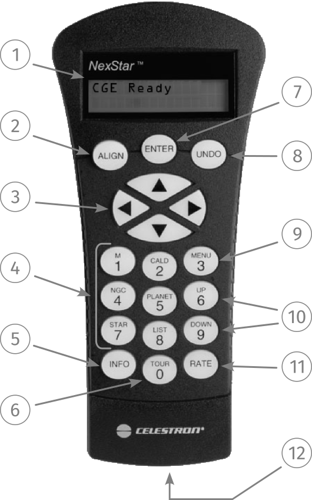

# NexStar Controller Reference



## Controller menus

### `MENU`

```{mermaid}
graph LR
    A(MENU) --> B(TRACKING)

    A(MENU) --> C(VIEW TIME-SITE)
    A(MENU) --> D(SCOPE SETUP)
    A(MENU) --> E(UTILITIES)
    A(MENU) --> F(USER OBJECTS)
    A(MENU) --> G(GET RA & DEC)
    A(MENU) --> H(GOTO RA & DEC)
    A(MENU) --> I(IDENTIFY)
    A(MENU) --> J(PRECISE GOTO)
```

#### `TRACKING`

```{mermaid}
graph LR
    B(TRACKING) --> B1(MODE)
        B1 --> B11(EQ NORTH)
        B1 --> B12(EQ SOUTH)
    B(TRACKING) --> B2(RATE)
        B2 --> B21(SIDEREAL)
        B2 --> B22(SOLAR)
        B2 --> B23(LUNAR)
```

#### `SCOPE SETUP`

```{mermaid}
graph LR
    D(SCOPE SETUP) --> D1(SETUP TIME-SITE)
    D(SCOPE SETUP) --> D2(ANTI-BACKLASH)
    D(SCOPE SETUP) --> D3(FILTER LIMITS)
    D(SCOPE SETUP) --> D4(DIRECTION BUTTONS)
    D(SCOPE SETUP) --> D5(GOTO APPROACH)
    D(SCOPE SETUP) --> D6(AUTOGUIDE RATES)
    D(SCOPE SETUP) --> D7(OTA ORIENTATION)
    D(SCOPE SETUP) --> D8(MERIDIAN)
    D(SCOPE SETUP) --> D9(MOUNT SETTINGS)
    D(SCOPE SETUP) --> D10(R.A. LIMITS)
```

#### `UTILITIES`

```{mermaid}
graph LR
    E(UTILITIES) --> E1(CALIBRATE MOUNT)
    E(UTILITIES) --> E2(HOME POSITION)
    E(UTILITIES) --> E3(LIGHTS CONTROL)
    E(UTILITIES) --> E4(FACTORY SETTINGS)
    E(UTILITIES) --> E5(VERSION)
    E(UTILITIES) --> E6(GET AXIS POSITION)
    E(UTILITIES) --> E7(GOTO AXIS POSITION)
    E(UTILITIES) --> E8(HIBERNATE)
    E(UTILITIES) --> E9(SUN MENU)
    E(UTILITIES) --> E10(SCROLLING MENU)
    E(UTILITIES) --> E11(SET MOUNT POSITION)
    E(UTILITIES) --> E12(TURN ON/OFF GPS)
    E(UTILITIES) --> E13(TURN ON/OFF RTC)
    E(UTILITIES) --> E14(PEC)
    E(UTILITIES) --> E15(MOVE TO SWITCH)
```

#### `USER OBJECTS`

```{mermaid}
graph LR
    F(USER OBJECTS) --> F1(GOTO SKY OBJECT)
    F(USER OBJECTS) --> F2(SAVE SKY OBJECT)
    F(USER OBJECTS) --> F3(SAVE DB OBJECT)
    F(USER OBJECTS) --> F4(ENTER RA & DEC)
    F(USER OBJECTS) --> F5(GOTO LAND OBJECT)
    F(USER OBJECTS) --> F6(SAVE LAND OBJECT)
```
