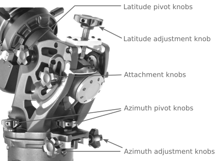

# Telescope Balance & Alignment

Proper telescope balance and alignment are crucial to ensure proper pointing,
and tracking and to eliminate undue stress on the telescope mount. Under normal
observing conditions balance and alignment should not be neccessary but if
pointing or tracking accuracy is significantly degraded or if cameras or other
accessories significantly change the weight distribution it may be required.

The telescope and counter-weights are heavy and balancing and alignment require
loosening of telsescope clutches and dovetail plate. For this reason it is best
that these procedures be conducted with the help ao an assistant. If you are not
comfortable with the procedures or need assistance, notify the observatory
director of any alignment or balance issues and and they will make arrangements
to provide you with assistance.

## Telescope balance

Before balancing the telescope mount all cameras and accesories that you intend
to use during your observing session including eyepieces for both the SCT and
William Optics APO. Small differences in eyepiece weight should not make an
appreciable difference. Try to ensure a symetrical distribution of weight.
Accessories mounted to the side, off the axis of rotation, will make it
difficult to get a proper balance. Ensure all cables and power cords are
properly routed and that the scope can move through it's entire range of motion
without binding.

```{warning}
When balancing, always make sure that you have physical control of the telescope
before loosening the clutches. An out of balance mount can move very quickly and
can cause damage to the tube or mount.
```

```{tip}
If you are balancing the scope to accomodate your equipment mark the position of
the counterweights and dovetail to make it easier to return it to the original
configuration afterwards. 
```

### Balancing the mount in Dec

The telescope mount only tracks in RA so precise balance along the Dec axis is
not as crucial but should be reasonably well balanced to minimize stress on the
mount and prevent it from swinging freely when the Dec clutch is released.

1. Verify that the telescope is securely attached to the telescope mounting
   dovetail and that all accessories are securly mounted.
2. Loosen the R.A. clutch knobs and rotate the telescope to one side of the
   mount with counterweight bar extended horizontally on the opposite side of the
   mount. Hand tighten the RA clutch knob to hold the scope in place.
3. Loosen the Dec clutch lock lever and rotate the telescope until the tube is
   parallel to the ground.
4. Allow the scope to rotate around the declination axis to see which way it
   goes. If it is front heavy it will need to slide back, if it is rear heavy it
   will need to slide forward.
5. Rotate the scope back to the top with the counterweight bar pointing down
   before loosening the dovetail plate knobs.
6. Slightly loosen the knobs that holds the telescope to the mounting dovetail
   and slide the telescope either forward or backward. Do not let go of the
   telescope tube while the knob on the mounting platform is loose.
7. Recheck the balance and repeat steps 2--6 until the Dec is balanced.
8. Rotate the tube so that it is parralell with the ground and securely tighten
   all knobs.

### Balancing the mount in RA

For accurate tracking and to eliminate stress on the mount, the telescope must
be properly balanced around the polar axis.

1. Again, verify that the telescope is securely attached to the telescope mounting
   dovetail and that all accessories are securly mounted.
2. Loosen the R.A. clutch knobs and rotate the telescope to one side of the
   mount with counterweight bar extended horizontally on the opposite side of the
   mount.
3. Allow the telescope to rotate around the RA ais to se wich way it rolls.
4. Rotate the scope back to where the counterweight bar is horizontal and loosen
   the set screws on the side of the counterweight.
5. Slide the counterwieghts left or right to the point where the scope does not
   rotate freely in RA when the clutches are released. Do not allow the counterweight
   bar to rotate down while the counterweights are loose.
6. Rotate the scope back to the top position and retighten all locking knobs.

```{note}
For improved tracking it is recomened that the RA axis is balanced slightly east
heavy. This means that if the scope is on the east side it should be slightly
heavier to the scope side, if the scope is on the west side it should be
slightly heavier to the counterweight side. This will help to compensate for any
backlash in the drive train.
```

## Polar alignment

For the telescope to track properly the mount RA axis must be aligned with the
Earth's axis of rotation with the azimuth aligned true north and the elevation
set to the latitude of the observatory. This is known as polar alignment. Polar
alignment of the telescope should not be neccessary unless the mount and scope
have been removed for maintenence or cleaning. If objects in the field of view
tend to drift over short periods of time the mount my require a polar alignment.



### All-Star Polar Alignment

You can check the polar alignment of the mount with the All-star polar alignment
feature of the controller.

```{mermaid}
graph LR
    A(ALIGN) --> B(POLAR ALIGN)
        B(POLAR ALIGN) --> B1(ALIGN MOUNT)
        B(POLAR ALIGN) --> B2(DISPLAY ALIGN)
```
